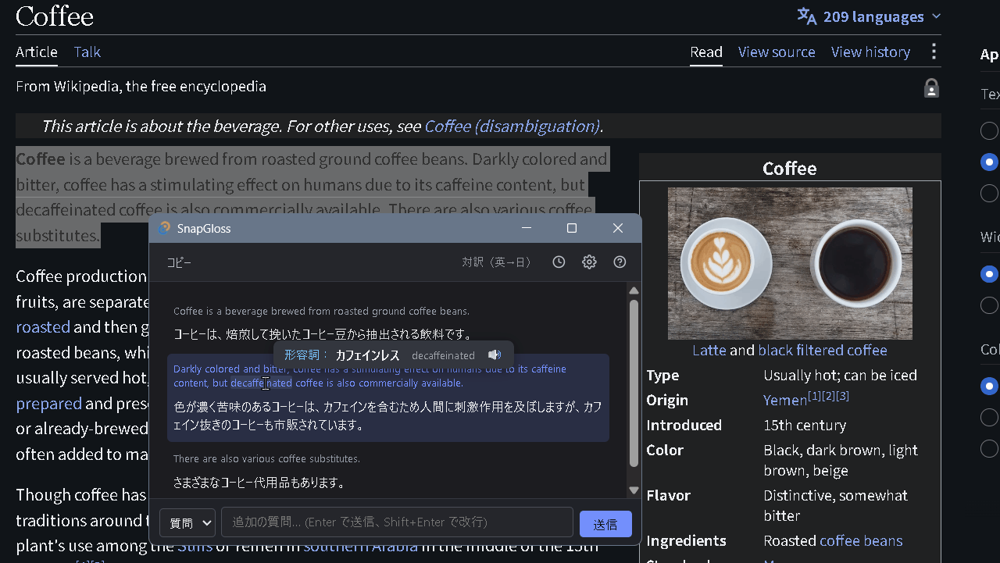
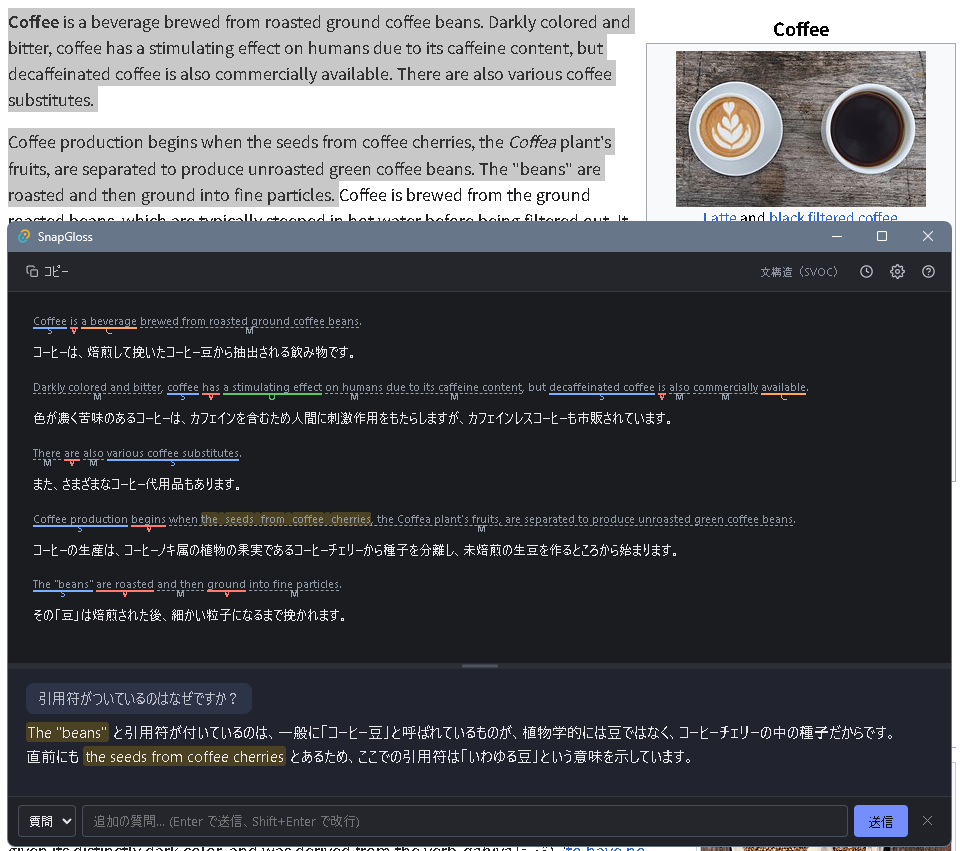

# SnapGloss

[](https://github.com/Taka-S-dev/SnapGloss/actions/workflows/test.yml)
[](https://github.com/Taka-S-dev/SnapGloss/actions/workflows/release.yml)
[](https://github.com/Taka-S-dev/SnapGloss/releases)

ブラウザでも Word でも、アプリを問わずテキストを選んでホットキーを押すだけ。翻訳・要約・文法解析・自由質問をその場で即実行し、結果をストリーミング表示します。



> **Built with:** Tauri v2 · Rust · TypeScript

---

## こんな使い方に

- 英語記事を読みながら、わからない単語をクリックしてその場で意味と品詞を確認（読み上げ付き）
- TOEIC の問題文をホットキーで投げて、文構造（SVOC）を色分け表示
- 長い英文メールを選択して即座に日本語に翻訳、気になる箇所を選択してそのまま追加質問
- 何も選択せず開いて、ちょっとした質問を AI に投げるランチャーとして

---

## 機能

- **翻訳・対訳・要約・校正・SVOC 分析・辞書・自由質問** — 選択テキストをワンキーで処理。カスタムプロンプトも追加可能
- **ストリーミング表示** — 応答が届いたそばから描画。長文でも待たされない
- **追加質問スレッド** — 結果に対して会話形式で深掘り。文法解説モードでは引用箇所を本文中にハイライト
- **単語ツールチップ** — 対訳の原文で単語をクリック／選択すると訳・品詞・読み上げをポップアップ
- **右クリックメニュー** — 選択箇所を Web 検索、または「この部分について質問」
- **履歴** — 直近 20 件の結果を API を呼ばずに再表示
- **リッチな描画** — Markdown（表・見出し・引用・コード）と mermaid 図を自動レンダリング
- **ライト／ダークテーマ** — OS 設定に追従、手動切替も可能
- **種類別の即実行** — 選択したテキストが英単語・英文・日本語・その他のどれかを判定し、種類ごとの既定モード（辞書・翻訳（自動）など）で即処理。既定は設定で変更でき、従来のモード選択画面を出す方式にも戻せる
- **設定のエクスポート／インポート** — プロンプトを含む設定一式を JSON ファイルで移行・共有（API キーは含まれない）



ブラウザで選択した英文を SVOC 色分け＋対訳で表示し、その内容について追加質問した例。回答が引用した本文箇所（黄色）は上ペインにも連動してハイライトされます。

---

## インストール

[**最新リリース**](https://github.com/Taka-S-dev/SnapGloss/releases/latest) からダウンロードできます：

| ファイル | 用途 |
|---|---|
| `snap-gloss_x.x.x_x64-setup.exe` | インストーラー（**推奨**。WebView2 未搭載環境も自動対応） |
| `snap-gloss_vx.x.x_x64_portable.exe` | インストール不要の単体版 |

動作環境は Windows 10/11。初回起動時に SmartScreen の警告が出た場合は「詳細情報」→「実行」で起動できます（コード署名を行っていないため）。

### 初期設定

1. 右下の ⚙ から設定を開く
2. OpenAI API キーを入力して保存
3. テキストを選択してホットキーを押す（デフォルト: `Ctrl+Shift+Z`）

ホットキー・モデル・テーマ等は設定から変更できます。Ollama 等のローカル LLM を使う場合はエンドポイントを変更すれば API キー不要で動作します。

設定とプロンプトは `%APPDATA%\SnapGloss\settings.json`、API キーは同フォルダの `apikey` に保存されます。ブラウザからは読み取れません。

v0.2.0 以前から更新した場合、旧保存先（`%APPDATA%\com.snapgloss.app`）の設定と API キーは初回起動時に自動で引き継がれます。

---

## 開発（ソースからビルド）

### 必要環境

- [Rust](https://rustup.rs/) (stable)
- [Node.js](https://nodejs.org/) 20+
- OpenAI API キー（または互換 API）

### 起動

```bash
npm install
npm run tauri dev
```

### ビルド

```bash
npm run tauri build
```

インストーラーは `src-tauri/target/release/bundle/` に生成されます（`v*` タグの push で GitHub Actions が自動ビルドし、ドラフトリリースに添付します）。

### アイコン

元絵は `src-tauri/icons/icon.svg`（完全版）、`icon-small.svg`（32・48px 用）、`icon-tiny.svg`（16・24px 用）の 3 つ。小さいサイズは要素を減らした絵を当て、`icon.ico` にはサイズごとに別の絵が入ります。SVG を直したら `python scripts/make-icons.py`（要 Pillow）で全サイズを作り直します。

### ホットキー取得の診断ログ

環境変数 `SNAPGLOSS_DEBUG` を設定して起動すると、ホットキー 1 回ごとの取得結果を
`%TEMP%\snapgloss-hotkey.log` に追記します（未設定なら何も出力しません）。

```powershell
$env:SNAPGLOSS_DEBUG = "1"; .\snap-gloss.exe
```

「選択したのにテキストが入らない」類の切り分け用です。前景アプリ名、修飾キーが離れたか、
クリップボードが実際に書き換わったか、何文字取得できたかが 1 行ずつ残ります。
コピー完了までの所要時間はアプリやリモートデスクトップ環境によって大きく異なります。

---

## 基本操作

| 操作                      | 説明                                                 |
| ------------------------- | ---------------------------------------------------- |
| テキスト選択 → ホットキー | テキストの種類ごとの既定モードで即実行（デフォルト: `Ctrl+Shift+Z`）|
| モード名クリック（左下）  | 別モードに切り替え／もう一度実行／既定にする／モード選択画面を開く |
| 「AIに質問」・文字入力・`Enter` | 追加質問の入力行を開く。空のまま `ESC` で閉じる       |
| `Enter` / `Shift+Enter`   | 追加質問を送信 / 改行                                |
| `ESC`                     | 内容をリセットしてウィンドウを隠す                   |
| `Ctrl+C`                  | 結果をコピー（テキスト未選択時）                     |
| `Ctrl+ホイール`           | フォントサイズ変更                                   |
| 単語クリック              | 日本語訳・品詞・読み上げをポップアップ表示           |
| 右クリック                | 選択箇所を Web 検索／この部分について質問            |

モード選択画面（設定「ホットキーで即実行」をオフにしたとき、またはメニューから開いたとき）：

| 操作                      | 説明                                                 |
| ------------------------- | ---------------------------------------------------- |
| `1`〜`9` / `↑↓←→`+`Enter` | モードを選択                                         |
| ホットキー 2度押し        | 前回と同じモードで即実行                             |
| `Ctrl+Enter`              | テキスト欄から選択中モードを実行                     |
| `Tab`                     | AI チャットを開く                                    |

アプリ内の「？」ボタンからも同じ一覧を確認できます。終了はタスクトレイの「終了」から。

---

## ファイル構成

```
SnapGloss/
├── index.html            # UI 全体（オーバーレイ含む）
├── src/
│   ├── main.ts           # エントリーポイント
│   ├── state.ts          # 共有状態・型定義・デフォルトプロンプト
│   ├── constants.ts      # 定数（タイムアウト・フォントサイズ等）
│   ├── renderer.ts       # Markdown・対訳パーサー・SVOC タグ補正
│   ├── mermaidRender.ts  # mermaid 図の遅延レンダリング
│   ├── ui.ts             # DOM 操作・ハイライト
│   ├── api.ts            # API 呼び出し（ストリーミング・会話履歴）
│   ├── history.ts        # 結果履歴
│   ├── settings.ts       # 設定の読み書き・モーダル・エクスポート
│   ├── tooltip.ts        # 単語ツールチップ
│   ├── modeOverlay.ts    # モード選択オーバーレイ
│   ├── contextMenu.ts    # 右クリックメニュー
│   └── styles.css        # 配色トークン（ライト／ダーク）
└── src-tauri/
    ├── src/lib.rs        # Rust バックエンド（ホットキー・クリップボード・設定保存）
    └── tauri.conf.json
```

---

## ライセンス

[MIT](LICENSE)
